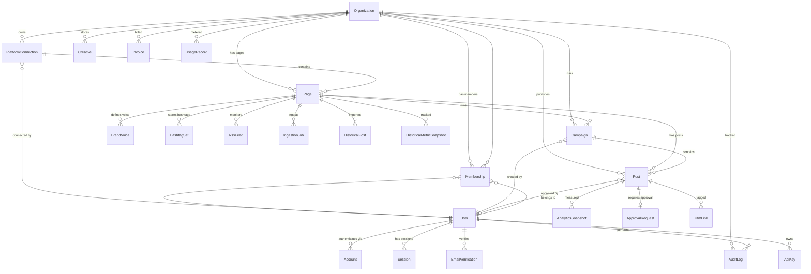

# AdPilot Database Schema Documentation

**Database:** PostgreSQL 16
**ORM:** Prisma v6
**Schema file:** `packages/db/prisma/schema.prisma`

---

## Models Overview

AdPilot has 27 models organized into logical groups.

### Core Models

| Model | Description |
|-------|-------------|
| **Organization** | Multi-tenant container. Owns subscriptions, plan limits, team memberships, and all business data. Soft-deletable (`deletedAt`). |
| **User** | Individual user account. Belongs to organizations via Membership. Stores timezone, locale, and system role. |
| **Membership** | Join table linking Users to Organizations with a Role (OWNER, ADMIN, EDITOR, VIEWER). |
| **Invitation** | Pending team invitations with hashed tokens, expiry, and status tracking. |

### Authentication (NextAuth.js)

| Model | Description |
|-------|-------------|
| **Account** | NextAuth.js OAuth provider accounts (Google, Microsoft). Stores provider tokens. |
| **Session** | Active user sessions with expiration. |
| **VerificationToken** | NextAuth.js email verification tokens. |
| **EmailVerification** | Application-level verification tokens for email verification, password reset, team invites, and email changes. Tokens stored as SHA-256 hashes. |
| **Authenticator** | WebAuthn/passkey credentials for FIDO2 authentication. |

### Platform Connections

| Model | Description |
|-------|-------------|
| **PlatformConnection** | OAuth connection to a social platform. Stores encrypted access/refresh tokens. Unique per org + platform + platform user. |
| **Page** | Individual social media page/account under a connection (e.g., a Facebook Page, Instagram Business Account). Scopes all content operations. |

### Content & Publishing

| Model | Description |
|-------|-------------|
| **Post** | Social media post. Belongs to an org, optionally to a page and campaign. Tracks status through full lifecycle (DRAFT -> SCHEDULED -> PUBLISHED). |
| **Campaign** | Groups posts under a marketing campaign with objective, budget, and date range. |
| **Creative** | Media assets (images, videos, carousels) stored in Cloudflare R2. |
| **PostTemplate** | Reusable post templates per organization. |
| **ContentTemplate** | Page-level or org-wide content templates. |
| **ApprovalRequest** | Tracks post approval workflow (PENDING, APPROVED, REJECTED). One-to-one with Post. |

### AI & Content Intelligence

| Model | Description |
|-------|-------------|
| **BrandVoice** | Per-page brand voice profiles with sample texts and AI-generated system prompts. |
| **HashtagSet** | Curated hashtag collections per page, categorized for reuse. |
| **RssFeed** | RSS feed subscriptions per page. Can auto-generate posts from new items. |

### Analytics

| Model | Description |
|-------|-------------|
| **AnalyticsSnapshot** | Point-in-time engagement metrics for a post (impressions, reach, clicks, likes, etc.). Multiple snapshots per post for trend tracking. |
| **PerformanceReport** | Generated performance reports (weekly, monthly) with aggregated data and optional PDF export. |

### Historical Data Ingestion

| Model | Description |
|-------|-------------|
| **IngestionJob** | Tracks progress of historical data import for a page. Supports pause/resume and rate limit tracking. |
| **HistoricalPost** | Imported historical posts from platform APIs with engagement metrics. |
| **HistoricalMetricSnapshot** | Historical page-level metrics (followers, reach, impressions) by date. |

### Automation

| Model | Description |
|-------|-------------|
| **WebhookEvent** | Incoming webhook events from social platforms. Deduped by platform + event ID. |
| **WebhookRule** | Automation rules (e.g., "when post reaches 100 likes, send email"). |

### Billing

| Model | Description |
|-------|-------------|
| **Invoice** | Synced from Stripe webhooks. Stores amounts, status, hosted URLs, and PDF links. |
| **UsageRecord** | Per-org usage metrics (posts published, AI tokens used, API calls) by billing period. |
| **PaymentMethod** | Synced payment methods from Stripe (card brand, last4, expiry). |

### Links & Leads

| Model | Description |
|-------|-------------|
| **UtmLink** | UTM-tagged links with click tracking. Optionally tied to a post. |
| **LeadCapture** | Leads captured from forms, optionally scoped to a page. |

### Admin & System

| Model | Description |
|-------|-------------|
| **AuditLog** | Immutable audit trail for all significant actions. Stores before/after state, IP, and user agent. |
| **FeatureFlag** | Feature flags with global default, per-tier, and per-org overrides. |
| **SystemMetric** | Time-series system metrics (active users, posts today, API latency). |
| **Announcement** | Admin-created announcements with scheduling and tier targeting. |
| **WaitlistEntry** | Pre-launch waitlist with plan interest and referral tracking. |
| **ApiKey** | API keys for programmatic access. Stored as bcrypt hashes. Scoped to specific permissions. |

---

## Enums

| Enum | Values |
|------|--------|
| **Plan** | `FREE`, `PRO`, `AGENCY` |
| **Role** | `OWNER`, `ADMIN`, `EDITOR`, `VIEWER` |
| **Platform** | `FACEBOOK`, `INSTAGRAM`, `TIKTOK`, `LINKEDIN`, `TWITTER_X`, `GOOGLE_ADS`, `YOUTUBE`, `PINTEREST`, `SNAPCHAT` |
| **ConnectionStatus** | `ACTIVE`, `EXPIRED`, `REVOKED` |
| **UserStatus** | `ACTIVE`, `SUSPENDED`, `BANNED`, `PENDING_VERIFICATION`, `DEACTIVATED` |
| **SystemRole** | `USER`, `ADMIN`, `SUPER_ADMIN` |
| **SubscriptionStatus** | `ACTIVE`, `TRIALING`, `PAST_DUE`, `CANCELED`, `UNPAID`, `INCOMPLETE`, `PAUSED` |
| **BillingCycle** | `MONTHLY`, `ANNUAL` |
| **InviteStatus** | `PENDING`, `ACCEPTED`, `DECLINED`, `CANCELLED`, `EXPIRED` |
| **VerificationType** | `EMAIL_VERIFICATION`, `PASSWORD_SETUP`, `TEAM_INVITE`, `PASSWORD_RESET`, `EMAIL_CHANGE` |
| **InvoiceStatus** | `DRAFT`, `OPEN`, `PAID`, `VOID`, `UNCOLLECTIBLE` |
| **UsageMetric** | `POSTS_PUBLISHED`, `AI_TOKENS_USED`, `API_CALLS`, `MEDIA_STORAGE_MB`, `TEAM_MEMBERS`, `CONNECTED_ACCOUNTS` |
| **AnnouncementType** | `INFO`, `WARNING`, `MAINTENANCE`, `FEATURE` |
| **CampaignObjective** | `AWARENESS`, `TRAFFIC`, `ENGAGEMENT`, `CONVERSIONS`, `LEADS` |
| **CampaignStatus** | `DRAFT`, `SCHEDULED`, `ACTIVE`, `PAUSED`, `COMPLETED`, `FAILED` |
| **PostStatus** | `DRAFT`, `PENDING_APPROVAL`, `APPROVED`, `REJECTED`, `SCHEDULED`, `PUBLISHING`, `PUBLISHED`, `FAILED`, `DELETED` |
| **CreativeType** | `IMAGE`, `VIDEO`, `CAROUSEL`, `STORY`, `REEL` |
| **IngestionStatus** | `PENDING`, `RUNNING`, `PAUSED`, `COMPLETED`, `FAILED`, `CANCELLED` |

---

## Key Indexes

| Table | Index | Purpose |
|-------|-------|---------|
| Organization | `[plan, subscriptionStatus, deletedAt]` | Admin dashboard filtering by plan and status |
| Organization | `[plan, subscriptionStatus, billingCycle, deletedAt]` | Billing reports with cycle breakdown |
| Post | `[orgId, status, publishedAt]` | Dashboard post listing with date sorting |
| Post | `[status, scheduledAt]` | Cron job: find posts due for publishing |
| Post | `[orgId, pageId, status]` | Page-scoped post queries |
| AnalyticsSnapshot | `[postId, snapshotAt]` | Time-series analytics for a post |
| AuditLog | `[orgId, createdAt]` | Audit trail queries by org |
| AuditLog | `[entityType, entityId]` | Look up all changes to a specific entity |
| Invoice | `[orgId, status]` | Billing page invoice listing |
| HistoricalPost | `[pageId, publishedAt]` | Historical post timeline |
| Page | `[orgId, isActive]` | Active page listing for page selector |

---

## Soft Deletion

The following models support soft deletion via a `deletedAt` timestamp:

- **Organization** -- Soft-deleted orgs are excluded from queries via `deletedAt IS NULL` filters.
- **User** -- Soft-deleted users cannot log in but their data is preserved for audit purposes.

Soft-deleted records should be purged after 90 days per the data retention policy.

---

## ER Diagram (Core Models)



---

## Database Commands

```bash
# Generate Prisma client after schema changes
cd packages/db && npx prisma generate

# Create a new migration
npx prisma migrate dev --name description-of-change

# Apply migrations (production)
npx prisma migrate deploy

# Reset database (destructive -- dev only)
npx prisma migrate reset

# Browse data
npx prisma studio

# Seed demo data
npx prisma db seed

# Seed admin account
npx tsx prisma/seed-admin.ts
```
